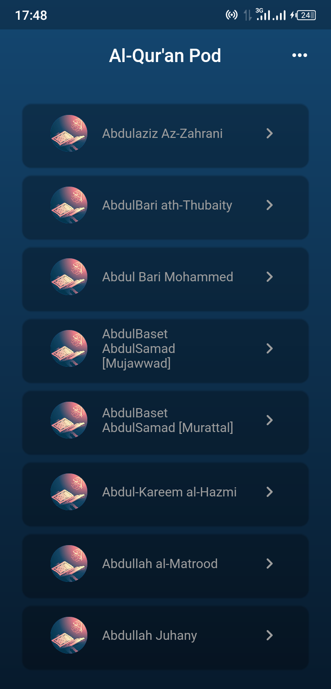
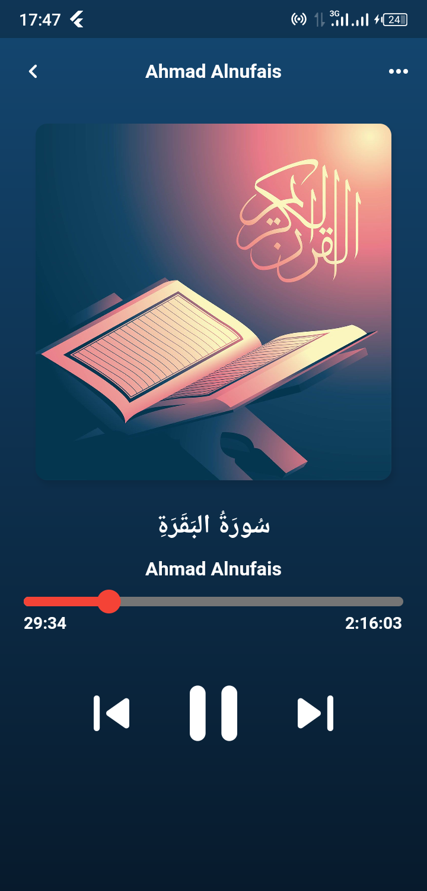

# Al-Qur'an Pod 🎧
[](https://pub.dev/packages/very_good_analysis)

A app for Muslims to stream **Al-Qur'an** recitations online.

## Technology Used 🔧
This app is built with the [*Flutter*](https://flutter.dev) framework and also uses data from the [Al-Quran cloud api](https://alquran.cloud/api).
## Features 🧩

* Users can select reciter of their choice form the list of reciters
* Background Audio 
* Background Audio control

## Screenshots 📸
|Reciters List Page|Audio player Page|
|---|---|
||| 


## Plugins 🔌 
|Name|Usage|
|--|--|
|audio_video_progress_bar| For the audio control slider|
|auto_size_text| For auto resizable texts|
|just_audio| for palying audio from remote source |
|just_audio_background| For playing audio in the background|
|rxdart| For reactive programming|


## Installation 🛠️
To install the app on your computer, make sure you have Flutter installed on your computer and clone this repository with

```sh
git clone https://github.com/Abdulrasheed1729/quran_pod.git
```
then run 
```sh
flutter pub get
```
to resolve dependencies and run
```sh
flutter run
```
to run the app.

## Release 

You can download the app apk file [here](https://drive.google.com/drive/folders/17fIgicZ31YGC8vbRaUE_buvmAzrph5J5?usp=sharing).

## Contributing 

If you have any issue with app or you have any suggestion consider opening a issue [**here**](https://github.com/Abdulrasheed1729/quran_pod/issues).

Also pull requests are welcome.
